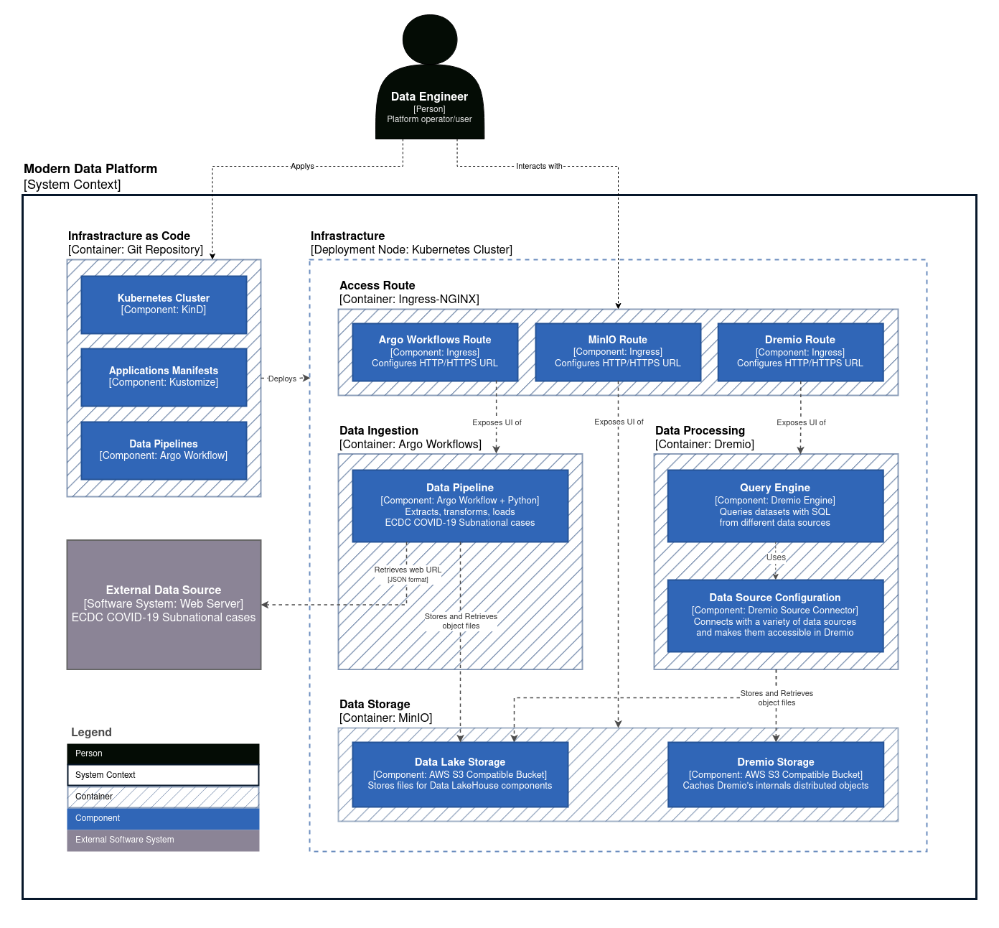
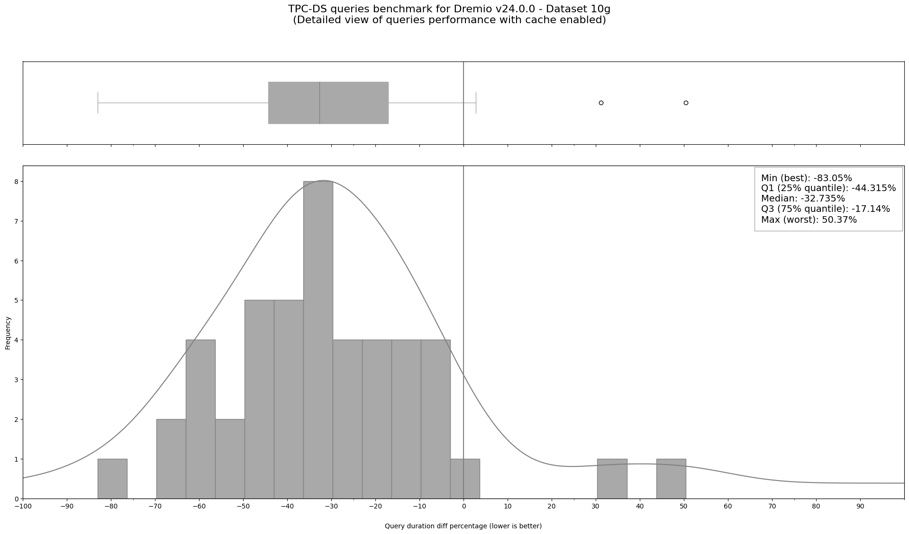

<!-- omit in toc -->
# Modern Data Platform PoC

A proof of concept for the core of Modern Data Platform using DataOps, Kubernetes, and Cloud-Native ecosystem
to build a resilient Big Data platform based on Data Lakehouse architecture which is the base for
Machine Learning (MLOps) and Artificial Intelligence (AIOps).

> **Note**
>
> This project is part of my Master of Science in Data Engineering
> at Edinburgh Napier University (April 2023).

<!-- omit in toc -->
## Contents
- [Architecture](#architecture)
- [Deployment](#deployment)
- [Benchmarking](#benchmarking)

## Architecture

<!-- omit in toc -->
### Core Components

The core components of the platform are:

- Infrastructure (Kubernetes)
- Data Ingestion (Argo Workflows + Python)
- Data Storage (MinIO)
- Data Processing (Dremio)

<!-- omit in toc -->
### Initial Model

To visualise the interactions of the current implementation, the
[C4 software architecture model](https://c4model.com/) (Context, Containers, Components, and Code)
is used.

The following is a simplified view of the initial architecture model
(all the abstractions are combined together).



## Deployment

**Prerequisites:** [asdf](https://asdf-vm.com/), Linux operating system, and Docker Engine
(tested with asdf 0.11.1, Ubuntu 20.04.5 LTS, and Docker Engine Community 23.0.1).

The following tools are used in the development:
- Helm
- KinD
- Kubectl
- Kustomize

They could be installed with corresponding versions via `asdf`:

```sh
asdf install
```

Create the local Kubernetes cluster:

```sh
kind create cluster \
  --config clusters/local/kind-cluster-config.yaml
```

Deploy the applications to the Kubernetes cluster:

```sh
kustomize build --enable-helm clusters/local | kubectl apply -f -
```

Wait for deployments to be ready:

```sh
# Ingress-Nginx.
kubectl rollout status deployment \
  --watch --namespace ingress-nginx ingress-nginx-controller

# MinIO.
kubectl rollout status deployment \
  --watch --namespace minio minio

# Argo Workflows.
kubectl rollout status deployment \
  --watch --namespace argo-workflows argo-workflows-server

# Dremio.
kubectl rollout status statefulset \
  --watch --namespace dremio dremio-master
```

Apply the data pipeline:

```sh
kubectl apply --namespace argo-workflows --filename \
  pipelines/ingestion/argo-workflow-covid19-subnational-data.yaml
```

## Benchmarking

<p align="center">
  
</p>

TPC-DS test suite has been used
to assess the performance of the platform.

For complete results, please check the project
[Jupyter Notebook](./benchmark/dremio_v24_0_0_tpc_ds_benchmark.ipynb)
in the [benchmarking section](./benchmark).
