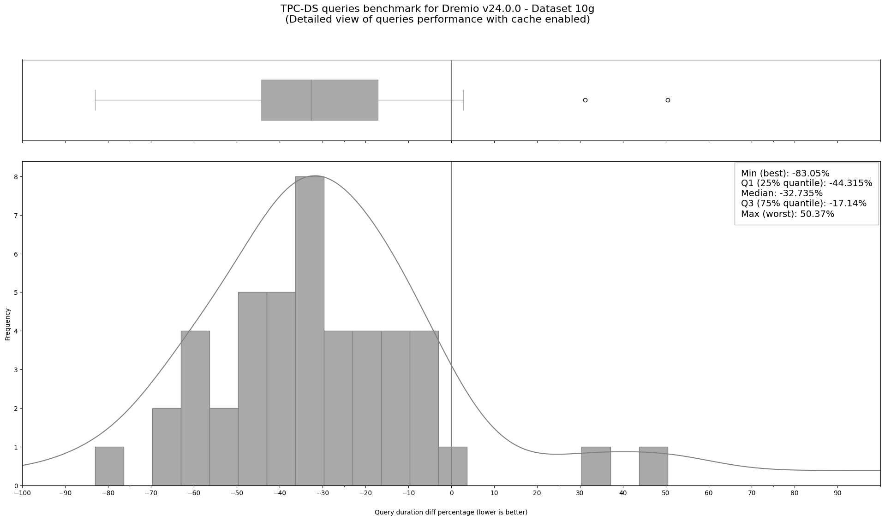

# Dremio Benchmark

This is a performance comparison between cold queries (without cache) and warm queries (with cache)
based on the Apache JMeter benchmark results.

[TPC-DS](https://www.tpc.org/tpcds/)  test suite has been used
to assess the performance of the platform. And the TPC-DS benchmark data
for Dremio was generated according to this guide:
[Dremio Benchmarking Methodology – How to Do It Yourself](https://www.dremio.com/blog/dremio-benchmarking-methodology/)

  
   
  Queries performance with cache enabled (median time enhancement 33%)

For complete results, please check the project [Jupyter Notebook](dremio_v24_0_0_tpc_ds_benchmark.ipynb).
